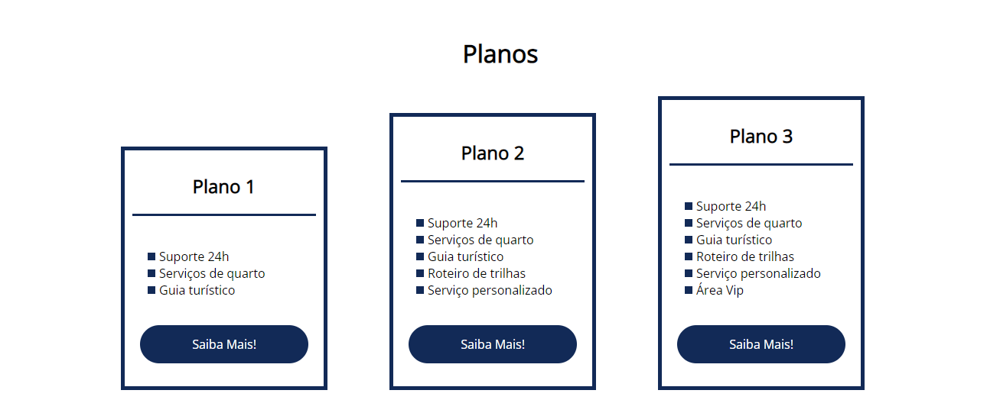

# HTML-CSS-LandindPage-FlexTurismos
Site construído para estudos de flexbox e suas propriedades. Constituido apenas por html e css.

## Link de acesso
https://fabriciosalustiano.github.io/HTML-CSS-LandindPage-FlexTurismos/

## Tela inicial:

## Tela de serviços:

## Tela de planos:

## Responsividade:

